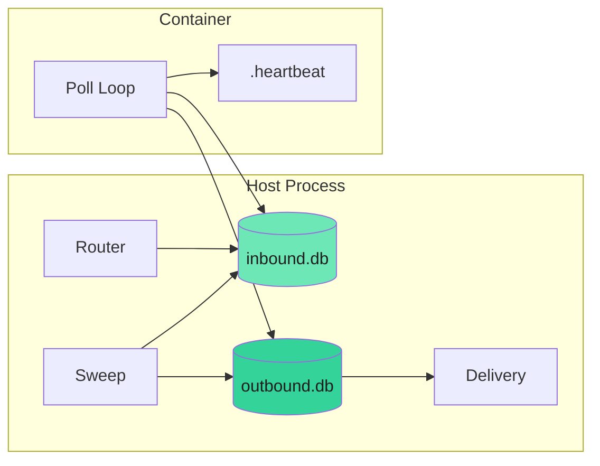

NanoClaw v2 uses per-session SQLite databases as the sole communication channel between the host process and containerized agents. There are no IPC files, no stdin piping, and no stdout markers.

## Architecture overview

Each session has two database files under `data/v2-sessions/{agent-group-id}/{session-id}/`:

- **`inbound.db`** — host writes, container reads
- **`outbound.db`** — container writes, host reads

A `.heartbeat` file is touched by the container for liveness detection.



## How it works

<Steps>
  <Step title="Host writes inbound message">
    When a platform message arrives, the router resolves the session and writes a `messages_in` row to `inbound.db` with status `pending` and `trigger=1` if the message should wake the agent.
  </Step>
  
  <Step title="Container wakes">
    The host calls `wakeContainer(session)` which spawns a container if one isn't already running. The container's poll loop detects pending messages in `inbound.db`.
  </Step>
  
  <Step title="Container processes message">
    The agent-runner claims the message via `processing_ack`, invokes the Claude SDK, and writes the response as a `messages_out` row in `outbound.db`.
  </Step>
  
  <Step title="Host delivers response">
    The delivery poll detects new `messages_out` rows and delivers them through the appropriate channel adapter.
  </Step>
</Steps>

## Inbound database schema

The `inbound.db` contains tables written by the host:

- **`messages_in`** — inbound messages (kind: `chat`, `chat-sdk`, `task`, `webhook`, `system`), with `status`, `process_after`, `recurrence`, and `series_id` for task grouping
- **`destinations`** — named routing map (name → channel type + platform ID + thread ID) for the agent's `send_message` tool
- **`session_routing`** — single-row default reply routing
- **`delivered`** — tracks delivery outcomes for outbound message IDs

## Outbound database schema

The `outbound.db` contains tables written by the container:

- **`messages_out`** — outbound messages with routing fields, `deliver_after`, and `recurrence`
- **`processing_ack`** — container tracks which messages it's actively processing (used by host sweep for stuck detection)
- **`session_state`** — persistent key/value store (e.g., SDK session ID for resume)
- **`container_state`** — single-row current tool-in-flight state (for stuck detection)

## Sequence numbering

Host and container use separate sequence spaces to avoid write conflicts:

- **Host** uses even `seq` numbers when writing to `inbound.db`
- **Container** uses odd `seq` numbers when writing to `outbound.db`

This ensures no sequence conflicts even though both processes may be writing simultaneously to their respective databases.

## System actions

The container communicates operations beyond simple messages by writing `messages_out` rows with `kind='system'` and an `action` field. The host delivery system interprets these:

| Action | Purpose |
|--------|---------|
| `schedule_task` | Create a new scheduled task (written to `inbound.db` as a `messages_in` row with `kind='task'`) |
| `cancel_task` | Cancel a task by ID or series ID |
| `pause_task` | Pause an active task |
| `resume_task` | Resume a paused task |
| `update_task` | Update prompt, schedule, or script of an existing task |

Task operations are applied by the host to the session's `inbound.db` since the container cannot write to it directly.

## Liveness detection

The container touches `/workspace/.heartbeat` periodically during operation. The host sweep (`src/host-sweep.ts`) runs every 60 seconds and checks:

1. **Heartbeat mtime** — if stale beyond a threshold, the container may be stuck
2. **Processing claim age** — long-outstanding claims in `processing_ack` indicate stuck work
3. **Container state** — the `container_state` table distinguishes legitimate long-running work from stuck containers

## Database pragmas

The `journal_mode=DELETE` pragma is required for cross-mount visibility. WAL mode does not work reliably across Docker bind mounts because the WAL file's shared memory mapping is not visible to the other process.

<Warning>
Do not change the journal mode in session databases. `DELETE` mode is load-bearing for host-container communication across bind mounts.
</Warning>

## Debugging

<Accordion title="Check inbound message status">
  ```bash
  sqlite3 data/v2-sessions/{group-id}/{session-id}/inbound.db \
    "SELECT seq, kind, status, process_after FROM messages_in ORDER BY seq DESC LIMIT 10;"
  ```
</Accordion>

<Accordion title="Check outbound messages">
  ```bash
  sqlite3 data/v2-sessions/{group-id}/{session-id}/outbound.db \
    "SELECT seq, kind, deliver_after FROM messages_out ORDER BY seq DESC LIMIT 10;"
  ```
</Accordion>

<Accordion title="Check heartbeat">
  ```bash
  stat data/v2-sessions/{group-id}/{session-id}/.heartbeat
  ```
  
  If the mtime is more than a few minutes old while a container is running, the container may be stuck.
</Accordion>

<Accordion title="Check processing claims">
  ```bash
  sqlite3 data/v2-sessions/{group-id}/{session-id}/inbound.db \
    "SELECT * FROM processing_ack;"
  ```
</Accordion>

## Related pages

- [Security model](/advanced/security-model) - Authorization and trust boundaries
- [Container runtime](/advanced/container-runtime) - How agents execute in containers
- [Troubleshooting](/advanced/troubleshooting) - Common communication issues
