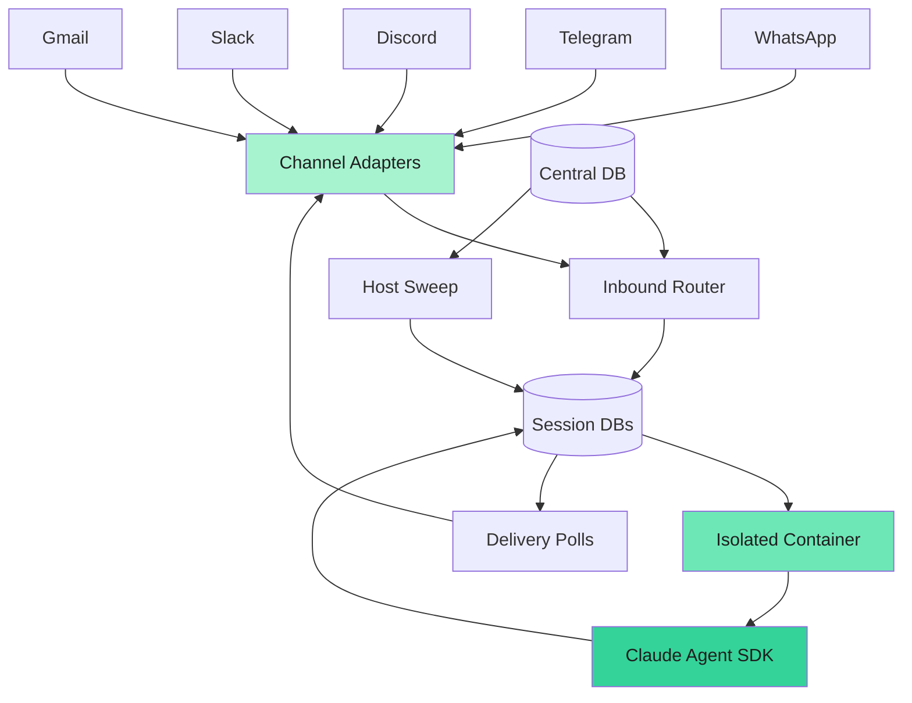
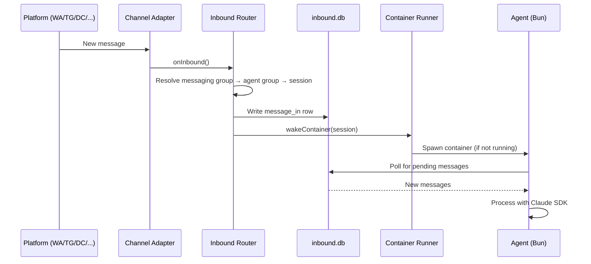
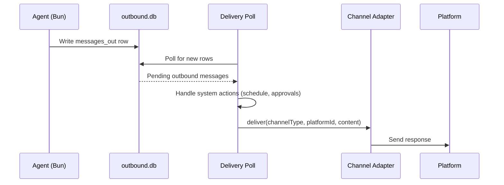

NanoClaw is a lightweight AI assistant that runs Claude Agent SDK in isolated containers. The architecture prioritizes simplicity, security through true isolation, and being small enough to understand completely.

## High-level overview

NanoClaw consists of a single Node.js host process that orchestrates everything. Containers communicate exclusively through per-session SQLite databases — there is no stdin piping, no stdout markers, and no IPC file watchers.



## Entity model

NanoClaw v2 uses a structured entity model instead of flat registered groups:

```
users (id "<channel>:<handle>", kind, display_name)
user_roles (user_id, role, agent_group_id)       — owner | admin (global or scoped)
agent_group_members (user_id, agent_group_id)    — unprivileged access gate

agent_groups (workspace, memory, CLAUDE.md, container config)
    ↕ many-to-many via messaging_group_agents (session_mode, trigger_rules, priority)
messaging_groups (one chat/channel on one platform; unknown_sender_policy)

sessions (agent_group_id + messaging_group_id + thread_id → per-session container)
```

Privilege is user-level (owner/admin), not agent-group-level. The `messaging_group_agents` junction table controls how an agent group engages with each chat — trigger mode (`pattern`, `mention`, `mention-sticky`), sender scope, ignored message policy, and session mode (`shared`, `per-thread`, `agent-shared`).

## Core components

### Channel adapters

NanoClaw uses a registry pattern for messaging channels. Each channel adapter self-registers at startup. Channels with missing credentials emit a warning and are skipped — no configuration file is needed to enable or disable them.

All channels implement a common `ChannelAdapter` interface with `onInbound`, `onInboundEvent`, `onMetadata`, and `onAction` callbacks, allowing the rest of the system to be channel-agnostic.

### Inbound router

The router (`src/router.ts`) handles inbound message routing:

- Resolves messaging group from channel type + platform ID
- Finds the correct agent group(s) via the `messaging_group_agents` wiring
- Resolves or creates a session (based on session mode)
- Writes messages to the session's `inbound.db`
- Wakes the container if not already running

<Info>
Everything is a message. The two session databases (inbound and outbound) are the sole IO surface between host and container.
</Info>

### Container runner

The container runner (`src/container-runner.ts`) spawns and manages isolated agent containers:

**Container lifecycle:**
1. Resolve agent group and read container config
2. Build volume mounts based on group configuration
3. Sync skill symlinks and compose CLAUDE.md
4. Spawn container with Docker CLI (entrypoint: `tini` → `bun run /app/src/index.ts`)
5. Container polls `inbound.db` for new messages and writes results to `outbound.db`
6. On exit, mark container stopped and clean up

**Key differences from v1:**
- No stdin/stdout communication — all IO via session databases
- No host-side idle timeout — stale detection driven by the host sweep reading `.heartbeat` mtime and `processing_ack` claim age
- Agent-runner source is a shared read-only mount, not a per-group writable copy
- Container entrypoint uses `tini` for PID 1 signal forwarding, runs Bun directly

### Delivery system

The delivery system (`src/delivery.ts`) replaces the old IPC watcher:

- Polls `outbound.db` for new `messages_out` rows written by the container
- Delivers messages through channel adapters
- Handles system actions (schedule tasks, approvals, self-modification requests)
- Two poll loops: active delivery (fast, for sessions with running containers) and sweep delivery (slower, catches stragglers)

### Host sweep

The host sweep (`src/host-sweep.ts`) runs every 60 seconds:

- Syncs `processing_ack` state between container and host
- Detects stale/stuck containers via heartbeat age and processing claim duration
- Wakes containers for due messages (scheduled tasks are `messages_in` rows with `kind='task'`)
- Handles recurring task rescheduling

### Database architecture

NanoClaw uses a three-database model:

**Central DB** (`data/v2.db`) stores everything that isn't per-session:

- `agent_groups` — workspace, memory, personality, container config
- `messaging_groups` — channel type, platform ID, unknown sender policy
- `messaging_group_agents` — wiring between messaging groups and agent groups with engage mode, session mode, priority
- `users` — namespaced IDs (e.g., `"phone:+1555..."`, `"tg:123"`, `"discord:456"`)
- `user_roles` — owner (always global), admin (global or scoped)
- `agent_group_members` — unprivileged access gate
- `sessions` — agent_group_id, messaging_group_id, thread_id, status, container_status

**Inbound DB** (`inbound.db`, per-session) — host writes, container reads:

- `messages_in` — all inbound messages including scheduled tasks (`kind='task'`), with status tracking, `process_after` for scheduling, and `recurrence` for cron/interval
- `destinations` — named routing map for agent-to-agent and channel sends
- `session_routing` — default reply routing for the session

**Outbound DB** (`outbound.db`, per-session) — container writes, host reads:

- `messages_out` — outbound messages, files, system actions
- `processing_ack` — container tracks processing status
- `session_state` — persistent key/value (stores SDK session ID for resume)

<Warning>
Each database file has exactly one writer (host or container) to avoid cross-mount lock contention. The heartbeat is a file touch at `/workspace/.heartbeat`, not a DB update.
</Warning>

## Data flow

### Inbound message flow



### Outbound delivery flow



## File system layout

<Tree>
  <Tree.Folder name="nanoclaw" defaultOpen>
    <Tree.Folder name="src" />
    <Tree.Folder name="container" defaultOpen>
      <Tree.File name="Dockerfile" />
      <Tree.File name="CLAUDE.md" />
      <Tree.Folder name="agent-runner" />
      <Tree.Folder name="skills" />
    </Tree.Folder>
    <Tree.Folder name="groups" defaultOpen>
      <Tree.Folder name="{agent-group}" defaultOpen>
        <Tree.File name="CLAUDE.md" />
        <Tree.File name="CLAUDE.local.md" />
        <Tree.File name="container.json" />
      </Tree.Folder>
      <Tree.Folder name="global" />
    </Tree.Folder>
    <Tree.Folder name="data" defaultOpen>
      <Tree.File name="v2.db" />
      <Tree.Folder name="v2-sessions" defaultOpen>
        <Tree.Folder name="{agent-group-id}" defaultOpen>
          <Tree.Folder name=".claude-shared" />
          <Tree.Folder name="{session-id}" defaultOpen>
            <Tree.File name="inbound.db" />
            <Tree.File name="outbound.db" />
            <Tree.File name=".heartbeat" />
            <Tree.Folder name="outbox" />
          </Tree.Folder>
        </Tree.Folder>
      </Tree.Folder>
    </Tree.Folder>
  </Tree.Folder>
</Tree>

## Container image

The agent container (`container/Dockerfile`) includes:

- **Base**: `node:22-slim`
- **Browser**: Chromium with all required dependencies
- **Agent runtime**: Bun (for running agent-runner TypeScript directly, no build step)
- **Tools**: `agent-browser` CLI for browser automation, `curl`, `git`, `vercel`
- **Claude SDK**: `@anthropic-ai/claude-code` (installed globally via pnpm)
- **PID 1**: `tini` for correct signal forwarding so DB writes finalize on shutdown
- **User**: Runs as `node` user (uid 1000, non-root)
- **Working directory**: `/workspace/group`
- **CJK fonts**: Opt-in via `INSTALL_CJK_FONTS=true` build arg (saves ~200MB by default)

<Info>
Agent-runner source is NOT baked into the image. It's provided via a shared read-only bind mount at `/app/src` from `container/agent-runner/src/`. Source-only changes never require an image rebuild.
</Info>

## Subsystems

### Session management

Each session has its own directory under `data/v2-sessions/{agent-group-id}/{session-id}/`:

- Contains `inbound.db`, `outbound.db`, `.heartbeat`, and `outbox/`
- Claude SDK state stored in a shared `.claude-shared/` directory per agent group
- Session mode controls isolation: `shared` (one session per messaging group), `per-thread` (one per thread), or `agent-shared` (shared across messaging groups)

### Skills system

Skills are managed via symlinks rather than bulk copying:

- Skills defined in `container/skills/` are mounted read-only at `/app/skills/` inside containers
- Per-group skill selection is controlled by `container.json` (`skills: 'all'` or an explicit list)
- Symlinks in `.claude-shared/skills/` point to `/app/skills/{name}` (valid inside the container)
- Skill symlinks are synced on every container spawn based on the current `container.json`

### CLAUDE.md composition

Each agent group's `CLAUDE.md` is composed from multiple sources on every container spawn:

- **Shared base**: `container/CLAUDE.md` (mounted read-only at `/app/CLAUDE.md`)
- **Per-group composed entry**: `groups/{folder}/CLAUDE.md` (imports the shared base via a symlink)
- **Skill fragments**: `groups/{folder}/.claude-fragments/` (read-only nested mount)
- **Per-group memory**: `groups/{folder}/CLAUDE.local.md` (read-write, persists agent-written notes)
- **Global memory**: `groups/global/` (read-only mount at `/workspace/global`)

<Note>
The composed CLAUDE.md is regenerated on every spawn. Only `CLAUDE.local.md` persists agent-written content across sessions.
</Note>

## Startup sequence

1. **Database initialization**: Init central DB at `data/v2.db`, run migrations
2. **Filesystem cutover**: One-time migration of group files (idempotent, no-op after first run)
3. **Container runtime**: Ensure Docker is running, clean up orphaned containers
4. **Channel adapters**: Initialize with `onInbound`, `onInboundEvent`, `onMetadata`, and `onAction` callbacks
5. **Delivery adapter bridge**: Connect delivery system to channel adapters
6. **Delivery polls**: Start active and sweep delivery poll loops
7. **Host sweep**: Start 60-second sweep loop (stale detection, due-message wake, recurrence)
8. **Shutdown handlers**: Register graceful shutdown on `SIGTERM` and `SIGINT`

## Graceful shutdown

On `SIGTERM` or `SIGINT`:

1. Run registered shutdown callbacks (modules clean up)
2. Stop delivery polls
3. Stop host sweep
4. Tear down channel adapters
5. Process exits with code 0

<Warning>
Containers are intentionally not killed during shutdown. They detect the host is gone via heartbeat staleness and exit on their own.
</Warning>

## Related topics

- [Security model and isolation](/concepts/security)
- [Group isolation and privileges](/concepts/groups)
- [Container isolation details](/concepts/containers)
- [Scheduled tasks system](/concepts/tasks)
